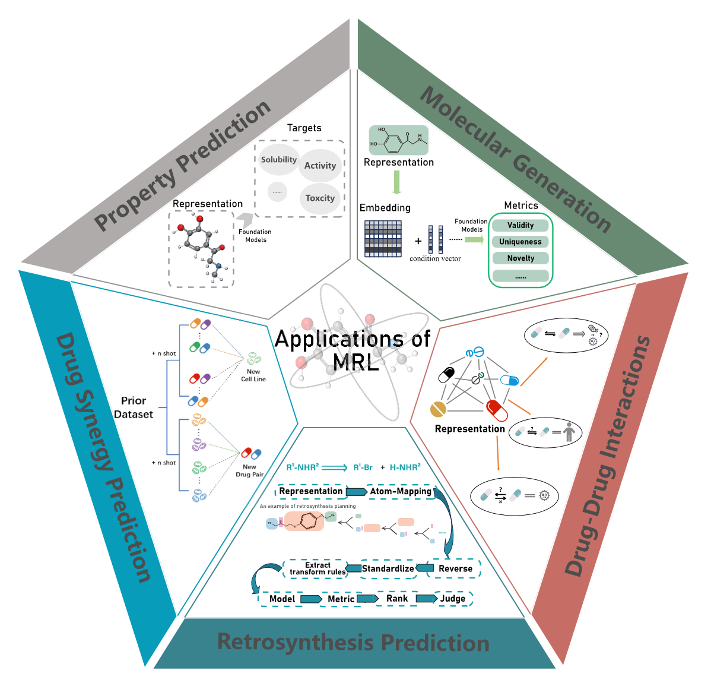

# A Systematic Review of Molecular Representation Learning Foundation Models

## Purpose of This Repository
Welcome to the **A Systematic Review of Molecular Representation Learning Foundation Models**! This repository has been created to provide supplementary documents to be published in **Breifings in BioInformatics** journal. The purpose of this repository is to ensure **transparency, reproducibility, and accessibility** of all data, methodologies, and figures used in the review process.

Here, you will find well-organized tables, repositories, and documentation related to different aspects of the systematic review. The repository is structured to facilitate collaboration and allow researchers to easily access relevant information based on their specific interests.

## Repository Structure
The repository consists of multiple folders, each dedicated to a different scope of information related to the systematic review:

### 1. **Figures ("/Figures")**
   - Contains all figures of the article. 
   
### 2. **Tables ("/Tables")**
   - Detailed tables providing information of representative molecular representation foundation models (MRFMs) from recent years.
   
### 3. **References & Citation Management ("/References")**
   - Bibliographic databases, citation files (BibTeX), and reference management details.

## Contact & Acknowledgments
For inquiries or collaborations, please reach out to the repository maintainer:

**[Jiayi Zhang]**  
[meowbean@hnu.edu.cn]  
[College of Computer Science and Electronic Engineering, Hunan University]  

---
